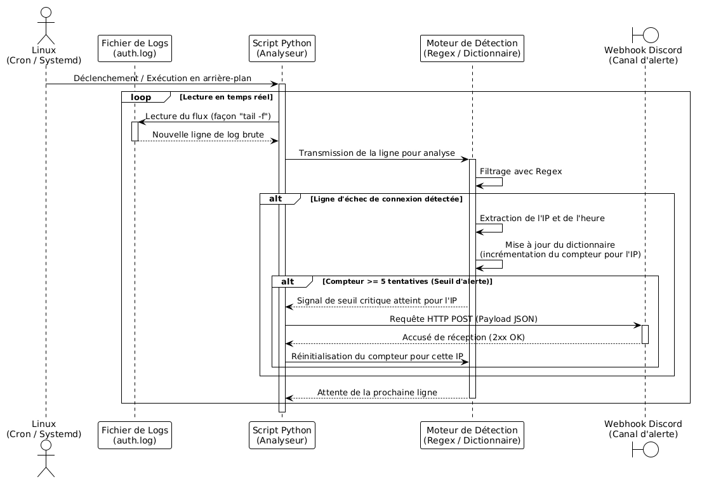

# Log Analyzer and Automated Alerts

## 1. Business Problem Solved
This tool demonstrates practical system diagnosis and a fundamental understanding of security, specifically access management.

## 2. Technical Functionality
* The application runs in the background and monitors a critical Linux server log file, such as `/var/log/auth.log` or Nginx container logs, in real-time.
* It uses regular expressions (the `re` module) to extract the IP address and timestamp specifically from failed connection attempts.
* The script stores problematic IP addresses in a data structure, such as a dictionary, to count their occurrences.
* It detects anomalies by isolating malicious IP addresses once an alert threshold (e.g., 5 failed attempts from the same IP) is reached.
* An automated notification containing a JSON payload (with the targeted IP, date, and time) is sent via an HTTP POST request to a Discord Webhook channel.

## 3. Prerequisites and Setup
* **Environment**: A Linux Virtual Machine (e.g., Ubuntu via VirtualBox) or Windows Subsystem for Linux (WSL) is required.
* **Permissions**: Understanding of Linux permissions (`chmod`, `chown`) is necessary to allow the script to securely read system logs located in `/var/log/`.
* **Security Note**: The Discord Webhook URL must never be hardcoded into the script. It must be retrieved via an environment variable using the `os` module.

## 4. Execution and Usage
Unlike a simple "one-shot" script, this engine is designed to run as a continuous background process (a Daemon) using a `while True:` loop. This allows it to monitor the log file in real-time, waiting for new connections to be appended to the file.

# Deployment via Systemd
To make the script fully autonomous and resilient, it is deployed as a native Linux service using `systemd`. This ensures the script starts on boot, restarts on failure, and securely receives environment variables.

**1. Create the Service File:**
Create a file at `/etc/systemd/system/log-analyzer.service` with the following configuration:

    ```ini
    [Unit]
    Description=Log Analyzer Security Engine
    After=network.target

    [Service]
    Type=simple
    User=benlamir
    Environment="DISCORD_WEBHOOK=[https://discordapp.com/api/webhooks/YOUR_DISCORD_WEBHOOK_URL](https://discordapp.com/api/webhooks/YOUR_DISCORD_WEBHOOK_URL)"
    ExecStart=/usr/bin/python3 /home/benlamir/analyzer.py
    Restart=on-failure
    RestartSec=5

    [Install]
    WantedBy=multi-user.target

**2. Test file:**
Place the auth.log file in '/home/'

## 5. Architecture


 
